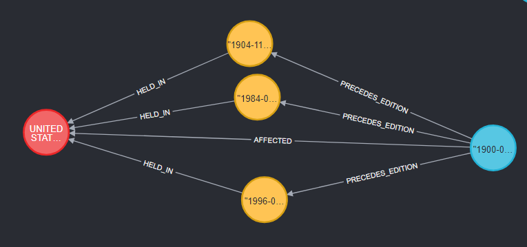
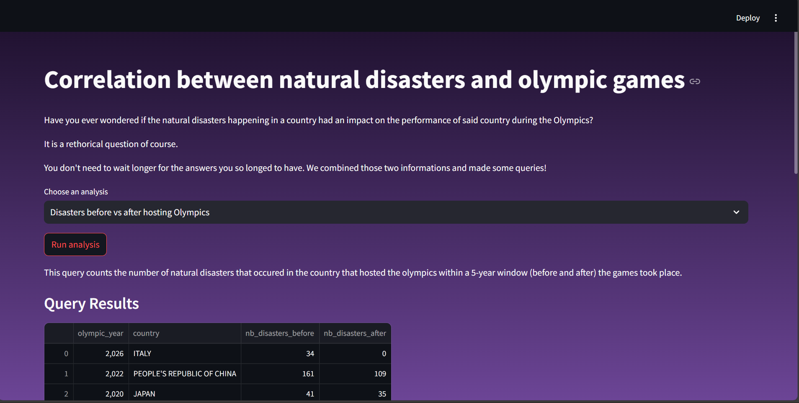

# Data Engineering Project Report - Triple Queenery <!-- omit in toc -->

by BARATOVA Malika, DAI Qinshu, NOUR ELLIL Hafsa

- [Abstract](#abstract)
- [Datasets Description](#datasets-description)
- [Queries](#queries)
- [Pipeline](#pipeline)
  - [Data Ingestion](#data-ingestion)
  - [Data Cleaning](#data-cleaning)
  - [Data Wrangling](#data-wrangling)
  - [Graph Construction / Neo4j Loading](#graph-construction--neo4j-loading)
- [Graph Schema Overview](#graph-schema-overview)
- [Production Layer – Analytical Queries](#production-layer--analytical-queries)
  - [1. Which countries appear the most resilient to natural disasters?](#1-which-countries-appear-the-most-resilient-to-natural-disasters)
  - [2. How does Olympic performance evolve before and after major earthquakes?](#2-how-does-olympic-performance-evolve-before-and-after-major-earthquakes)
  - [3. Do natural disasters tend to occur shortly before or after Olympic Games hosted by a country?](#3-do-natural-disasters-tend-to-occur-shortly-before-or-after-olympic-games-hosted-by-a-country)
  - [4. If an athlete won a medal, has his country been affected by a natural disaster?](#4-if-an-athlete-won-a-medal-has-his-country-been-affected-by-a-natural-disaster)
  - [5. Is there any sort of correlation between a country’s overall average Olympic performance and its exposure to disasters?](#5-is-there-any-sort-of-correlation-between-a-countrys-overall-average-olympic-performance-and-its-exposure-to-disasters)
- [Requirements](#requirements)
- [Run the Project](#run-the-project)
- [Trouble Shooting](#trouble-shooting)

## Abstract
This project implements a comprehensive 3 pipeline ETL to analyze the correlation between natural disasters and Olympic Games throughout history.
We integrate 2 datasets: Olympic Games (1896–2032) from kaggle and natural disaster data (1900–2025) from EM-DAT, the international disaster database.

## Datasets Description 

We used two datasets to answer our queries.

The first dataset is named **Olympic Historical Dataset From Olympedia.org** taken from Kaggle, it can be found at https://www.kaggle.com/datasets/josephcheng123456/olympic-historical-dataset-from-olympediaorg.
This dataset contains the information about the Winter and Summer Olympic games starting from the first edition in 1896 to the latest upcoming in 2032.
It is composed of six different csv files :
- Olympic_Athlete_Bio : data about each athlete that competed (e.g. name, country)
- Olympic_Athlete_Event_Results : each row represents the result of one athlete at one event (e.g. position and medal (if won) of athlete A at the 100 meters men event in the 1908 Summer Olympic games)
- Olympic_Games_Medal_Tally : medal tally of countries for each Olympic game, **this file was not used**
- Olympic_Results : each row represents the result of one event (e.g. when and where the 100 meters men event took place and its results), **this file was not used**
- Olympics_Country : list of countries names and their country code
- Olympics_Games : list of all the Olympic games (e.g. edition, year, city, start and end date)

The second dataset is named **Natural Disasters** taken from the site EM-DAT - The international disaster database, found at https://public.emdat.be/.
The dataset contains recorded natural disasters event from 1900 to 2025. Each row represents one natural disaster, the important information kept in the project are : country of origin, date and type of disaster. 

## Queries 
Questions formulated:

- Which countries appear the most resilient to natural disasters(having a good overall performance despite having experienced many natural disasters)?

- How does Olympic performance evolve before and after major earthquakes(magnitude>=6)?

- Do natural disasters tend to occur shortly before or after Olympic Games hosted by a country?

- If a disaster is happening in a country, has this country won a medal during this time?

- Is there any sort of correlation between a country’s overall average Olympic performance and its exposure to disasters?


## Pipeline


### Data Ingestion

The natural disaster datataset was downloaded manually from the website https://public.emdat.be and placed in a folder in the project, because you need to be logged in and ask permission to be able to download it.

The Olympic games dataset is obtained by calling the kaggle API via Python.

### Data Cleaning 

After having ingested the raw data into the landing folder, our aim was to clean the data by remove duplicates, fixing missing values, and normalising formats.

Some of these  operations include:

- Standardizing athlete IDs, names, and sex codes.

- We standardized country names and NOC codes by resolving inconsistencies between the Olympics dataset and the natural disasters dataset (e.g., Guinea-Bissau → Guinea Bissau). Our approach involved identifying country name pairs that shared at least one word between the two datasets, while ignoring common, non-specific words such as “Republic” that could apply to multiple countries. For names that could not be matched automatically, we manually inspected the remaining entries, which was manageable since there were only about 20 countries left.

- Filtering out invalid or incomplete data.

### Data Wrangling

We chose to not use some of the Olympic games files : 
- the medal tally file could not be used because it is aggregated data. 
- the Olympic results file did not provide us with useful information for our queries.

For the natural disaster dataset, we couldn't use all columns (they weren't useful for our queries anyway), like the death tally and the total amount of money used for the reconstruction.
We considered removing events that happened before a certain date because there is not enough disaster recorded. We decided finally to keep all the rows, because even in the last years we are not sure if all the event happening in the world are correctly recorded in this dataset.
Unfortunately, contrary to the Olympic dataset, we can't be sure that the information in this dataset is 100% correct and collects all the natural disaster events.  

Another major transformation involved countries that were historically divided but later unified. For example, before 1990, Yemen was split into North Yemen (the Yemen Arab Republic) and South Yemen (the People’s Democratic Republic of Yemen). As a result, our Olympics dataset includes entries for South Yemen, North Yemen, as well as unified Yemen, the goal of this transformation was to remove ambiguity.

Certain columns were dropped as we thought they aren't really relevant to our analysis(eg: the height or weight of an athlete)

### Graph Construction / Neo4j Loading

This stage takes the cleaned staging datasets and transforms them into a Neo4j graph. Its purpose is to prepare the graph enable the execution of rich, analytical queries linking Olympic data, athletes, and natural disasters.  

#### Constraints <!-- omit in toc -->

Constraints are applied on critical node properties to ensure data integrity. They prevent accidental duplication of nodes and guarantee that operations like `MERGE` behave predictably. For example, creating a uniqueness constraint on `Country.noc` ensures that no country is added multiple times under different entries, even if it appears repeatedly in multiple CSV files.

#### Nodes and Their Purpose <!-- omit in toc -->

- **Country**  
  The `Country` node is pivotal because it connects to four distinct entities:
  1. An **Athlete** originates from a country (`COMES_FROM` relationship).  
  2. A **Participation** links to a country representing which nation the athlete competed for (`REPRESENTED`).  
  3. An **OlympicEdition** is hosted in a country (`HELD_IN`).  
  4. A **NaturalDisaster** takes place in a country (`AFFECTED`).  

- **Athlete**  
  Represents an individual Olympian with unique identifiers. Connected to their country of origin and their participations in various editions and events.

- **OlympicEdition**  
  Represents a single edition of the Olympic Games. Linked to the host country and to all participations occurring in that edition.

- **SportEvent**  
  Represents a unique combination of a sport and event (e.g., "Tennis - Doubles, Handicap, Mixed").  

- **Participation** (central node)  
  This node models the many-to-many relationships between athletes, editions, events, and countries:
  - An athlete can participate in multiple editions.  
  - Within a single edition, an athlete can participate in multiple sport events.  
  - In rare historical cases, an athlete can represent different countries in different events within the same edition (e.g., Hedwig Rosenbaum in the 1900 Summer Olympics who represented both Bohemia and Great Britain for tennis). 

- **NaturalDisaster**  
  Represents disasters affecting countries, with temporal links to Olympic editions (`OVERLAP_EDITION`, `PRECEDES_EDITION`, `AFTER_EDITION`) to enable correlation analyses between disasters and Olympic events.

#### Relationships <!-- omit in toc -->

- `Athlete → Country (COMES_FROM)`: links each athlete to their country of origin.  
- `Athlete → Participation → OlympicEdition / SportEvent / Country`: models participation details, medals, and representation.  
- `NaturalDisaster → Country (AFFECTED)`: links disasters to affected countries.  
- `NaturalDisaster → OlympicEdition (temporal relations: OVERLAP, PRECEDES, AFTER)`: captures timing between disasters and Olympic events for analytical purposes.

## Graph Schema Overview


Below there is a graph from the neo4j interface showing the relations between a natural disaster, a country and a olympic edition. 


## Production Layer – Analytical Queries

### 1. Which countries appear the most resilient to natural disasters?

This query ranks countries by a “resilience” metric defined as the average medal score divided by the number of disasters affecting that country.

The idea is to:
- count the number of disasters affecting each country,
- compute an average Olympic performance score based on medals,
- and relate the two through a resilience indicator(average score divided by the ntotal number of disasters).

This allows us to identify countries that:
- experience frequent disasters,
- but still achieve high Olympic results.

### 2. How does Olympic performance evolve before and after major earthquakes?

The query compares the average Olympic performance (Gold = 3, Silver = 2, Bronze = 1, no medal = 0) before and after major earthquakes (magnitude ≥ 6) for countries affected by those earthquakes

For each affected country, we compare:
- average Olympic performance before the disaster,
- and average Olympic performance after the disaster.

### 3. Do natural disasters tend to occur shortly before or after Olympic Games hosted by a country?

This query counts the number of natural disasters that occured in the country that hosted the olympics within a 5-year window (before and after) the games took place.

The goal is to identify the total number of natural disasters that:
- occurred in the 5 years preceding an Olympic edition hosted by a country,
- or in the 5 years following it.

### 4. If an athlete won a medal, has his country been affected by a natural disaster?

This query counts how many natural disasters affected the country of origin of medal-winning athletes during the Olympic edition.

It identifies athletes who:
- competed during Olympic editions overlapping with natural disasters in their country of origin,
- and still managed to win medals.

### 5. Is there any sort of correlation between a country’s overall average Olympic performance and its exposure to disasters?

This query computes, per country:
- an average medal score per participation (Gold = 3, Silver = 2, Bronze = 1, no medal = 0)
- the total number of natural disasters that affected that country

## Requirements

To be able to download the dataset from Kaggle, you have to follow those steps : 
1. Create a folder named ```.kaggle``` in the dataeng_project folder
2. In Kaggle, login to your account then go  Home -> Settings -> Scroll down to the section API -> Create New Token
3. Save the kaggle.json file that you just downloaded inside the folder ```.kaggle```

> If you do not wish to get the kaggle API Key, a local copy of the dataset can be found in ```data_sources```. If you don't put your kaggle API Key in the folder, it will take those files instead.

To run the streamlit app, you need to install those libraries in an environment on your pc via ```pip install``` :
- streamlit
- plotly

## Run the Project

This project is run using Docker.  
The execution follows this pipeline: **Ingestion → Staging → Graph Creation → Analysis & Visualization**.

1. Copy the env file from the project root : 
```bash
cp .env.example .env
```

1. Then build the Docker images
```bash
docker compose build
```

1. Run the docker compose
```bash
docker compose up -d
```

1. Access Airflow from your browser

```
http://localhost:8080
```

5. Trigger the Airflow DAGs in this order
```
- 01_ingestion_dag
- 02_staging_dag  
- 03_production_dag
```
After the third dag is completed, the Neo4j graph is fully built.

The Neo4j database is stored in a Docker volume, which means:

- The graph persists after stopping Docker Compose
- The data is still available on the next `docker compose up -d`

(optional) You can access the neo4j interface to view the graph by yourself
```
http://localhost:7474/ 
(leave user and password blank)
```

6. Run the Streamlit application, navigate to the Streamlit application directory and launch it:
```bash
cd dags/app
streamlit run app.py
```
A local URL will be displayed in the terminal or opened automatically in your browser.

7. Run the queries by using the streamlit interface



## Trouble Shooting

We are aware that there is a problem with Macs while running the third dag. It is a memory issue. We couldn't find how to fix it. 
Everything runs well on Windows.

To make it function on macs, you can follow the steps below :
- run ```docker compose up```
- run the first two dags in Airflow (01 and 02)
- run ```docker compose down``` and ```docker compose up```
- run only the third dag

It should work, you can then run from the 6th step above.
