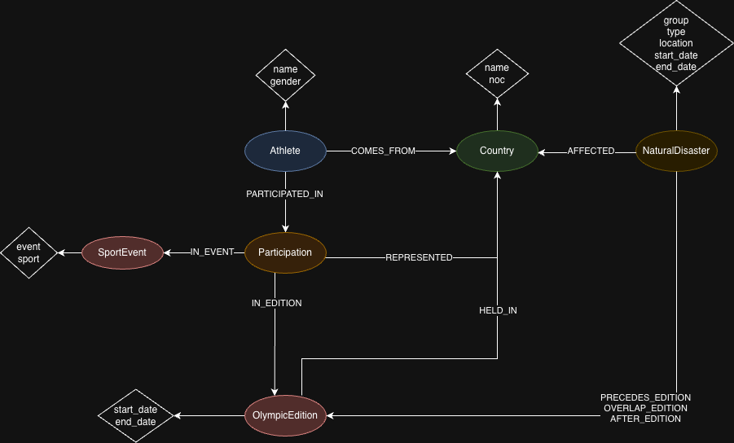

# Data Engineering Project Report - Triple Queenery

by BARATOVA Malika, DAI Qinshu, NOUR ELLIL Hafsa

## Abstract
This project implements a comprehensive 3 pipeline ETL to analyze the correlation between natural disasters and Olympic Games throughout history.
We integrate 2 datasets: Olympic Games (1896–2032) from kaggle and natural disaster data (1900–2025) from EM-DAT, the international disaster database.


## Datasets Description 

We used two datasets to answer our queries.

The first dataset is named **Olympic Historical Dataset From Olympedia.org** taken from Kaggle, it can be found at https://www.kaggle.com/datasets/josephcheng123456/olympic-historical-dataset-from-olympediaorg.
This dataset contains the information about the Winter and Summer Olympic games starting from the first edition in 1896 to the latest upcoming in 2032.
It is composed of six different csv files :
- Olympic_Athlete_Bio : data about each athlete that competed (e.g. name, country)
- Olympic_Athlete_Event_Results : each row represents the result of one athlete at one event (e.g. position and medal (if won) of athlete A at the 100 meters men event in the 1908 Summer Olympic games)
- Olympic_Games_Medal_Tally : medal tally of countries for each Olympic game, **this file was not used**
- Olympic_Results : each row represents the result of one event (e.g. when and where the 100 meters men event took place and its results), **this file was not used**
- Olympics_Country : list of countries names and their country code
- Olympics_Games : list of all the Olympic games (e.g. edition, year, city, start and end date)

The second dataset is named **Natural Disasters** taken from the site EM-DAT - The international disaster database, found at https://public.emdat.be/.
The dataset contains recorded natural disasters event from 1900 to 2025. Each row represents one natural disaster, the important information kept in the project are : country of origin, date and type of disaster. 

## Queries 
Questions formulated:

- Which countries appear the most resilient to natural disasters(having a good overall performance despite having experienced many natural disasters)?

- How does Olympic performance evolve before and after major earthquakes(magnitude>=6)?

- Do natural disasters tend to occur shortly before or after Olympic Games hosted by a country?

- If a disaster is happening in a country, has this country won a medal during this time?

- Is there any sort of correlation between a country’s overall average Olympic performance and its exposure to disasters?


## Pipeline

//ADD PIPELINE SCHEMA

### Data Ingestion

The natural disaster datataset was downloaded manually from the website https://public.emdat.be and placed in a folder in the project, because you need to be logged in and ask permission to be able to download it.

The Olympic games dataset is obtained by calling the kaggle API via Python.

---
### Data Cleaning 

After having ingested the raw data into the landing folder, our aim was to clean the data by remove duplicates, fixing missing values, and normalising formats.

Some of these  operations include:

- Standardizing athlete IDs, names, and sex codes.

- We standardized country names and NOC codes by resolving inconsistencies between the Olympics dataset and the natural disasters dataset (e.g., Guinea-Bissau → Guinea Bissau). Our approach involved identifying country name pairs that shared at least one word between the two datasets, while ignoring common, non-specific words such as “Republic” that could apply to multiple countries. For names that could not be matched automatically, we manually inspected the remaining entries, which was manageable since there were only about 20 countries left.

- Filtering out invalid or incomplete data.

---
### Data Wrangling

We chose to not use some of the Olympic games files : 
- the medal tally file could not be used because it is aggregated data. 
- the Olympic results file did not provide us with useful information for our queries.


For the natural disaster dataset, we couldn't use all columns (they weren't useful for our queries anyway), like the death tally and the total amount of money used for the reconstruction.
We considered removing events that happened before a certain date because there is not enough disaster recorded. We decided finally to keep all the rows, because even in the last years we are not sure if all the event happening in the world are correctly recorded in this dataset.
Unfortunately, contrary to the Olympic dataset, we can't be sure that the information in this dataset is 100% correct and collects all the natural disaster events.  

Another major transformation involved countries that were historically divided but later unified. For example, before 1990, Yemen was split into North Yemen (the Yemen Arab Republic) and South Yemen (the People’s Democratic Republic of Yemen). As a result, our Olympics dataset includes entries for South Yemen, North Yemen, as well as unified Yemen, the goal of this transformation was to remove ambiguity.

Certain columns were dropped as we thought they aren't really relevant to our analysis(eg: the height or weight of an athlete)

---
### Graph Construction / Neo4j Loading

This stage takes the cleaned staging datasets and transforms them into a Neo4j graph. Its purpose is to prepare the graph enable the execution of rich, analytical queries linking Olympic data, athletes, and natural disasters.  

#### Constraints

Constraints are applied on critical node properties to ensure data integrity. They **prevent accidental duplication** of nodes and guarantee that operations like `MERGE` behave predictably. For example, creating a uniqueness constraint on `Country.noc` ensures that no country is added multiple times under different entries, even if it appears repeatedly in multiple CSV files.

#### Nodes and Their Purpose

- **Country**  
  The `Country` node is pivotal because it connects to **three distinct entities**:
  1. An **Athlete** originates from a country (`COMES_FROM` relationship).  
  2. A **Participation** links to a country representing which nation the athlete competed for (`REPRESENTED`).  
  3. An **OlympicEdition** is hosted in a country (`HELD_IN`).  
  4. A **NaturalDisaster** takes place in a country (`AFFECTED`).  

  By making `Country` a separate node rather than a simple property, we enable queries across multiple contexts, because a country simultaneously acts as:
    - a place of **origin** for an athlete,
    - a **representation entity**(athelete representing a country for a sport in an olympics edition),
    - a **host location** for an olympics edition,
    - and a **geographical impact zone** for disasters

- **Athlete**  
  Represents an individual Olympian with unique identifiers. Connected to their country of origin and their participations in various editions and events.

- **OlympicEdition**  
  Represents a single edition of the Olympic Games. Linked to the host country and to all participations occurring in that edition.

- **SportEvent**  
  Represents a unique combination of a sport and event (e.g., "Tennis - Doubles, Handicap, Mixed").  

- **Participation** (central node)  
  This node is **mandatory** because it models the many-to-many relationships between athletes, editions, events, and countries:
  - An athlete can participate in multiple editions.  
  - Within a single edition, an athlete can participate in multiple sport events.  
  - In rare historical cases, an athlete can represent **different countries** in different events within the same edition (e.g., Hedwig Rosenbaum in the 1900 Summer Olympics who represented both Bohemia and Great Britain for tennis).  

  The `Participation` node allows us to capture these complex relationships cleanly, without duplicating athlete or edition nodes.

- **NaturalDisaster**  
  Represents disasters affecting countries, with temporal links to Olympic editions (`OVERLAP_EDITION`, `PRECEDES_EDITION`, `AFTER_EDITION`) to enable correlation analyses between disasters and Olympic events.

#### Relationships

Relationships encode the semantics between nodes:

- `Athlete → Country (COMES_FROM)`: links each athlete to their country of origin.  
- `Athlete → Participation → OlympicEdition / SportEvent / Country`: models participation details, medals, and representation.  
- `NaturalDisaster → Country (AFFECTED)`: links disasters to affected countries.  
- `NaturalDisaster → OlympicEdition (temporal relations: OVERLAP, PRECEDES, AFTER)`: captures timing between disasters and Olympic events for analytical purposes.


- **Batch loading & performance**: Large CSVs are ingested using `apoc.periodic.iterate` for efficiency.  

This structure enables rich analytical queries, allowing us to explore connections between natural disasters and Olympic events, athlete performance, and country resilience.

#### Graph Schema Overview




   


## Production Layer – Analytical Queries

The production layer exposes the graph to analytical workloads.  
At this stage, the data is considered clean, normalized, and fully connected, allowing us to formulate **high-level research questions** that explore potential correlations between **Olympic performance** and **natural disasters**.

Rather than focusing on raw entities, the production queries aim to extract **insights**, **patterns**, and **comparative indicators** across countries, athletes, and Olympic editions.

---

### 1. Which countries appear the most resilient to natural disasters?

This analysis investigates whether some countries manage to maintain strong Olympic performance despite being frequently affected by natural disasters.

The idea is to:
- count the number of disasters affecting each country,
- compute an average Olympic performance score based on medals,
- and relate the two through a *resilience indicator*(average score divided by the ntotal number of disasters).

This allows us to identify countries that:
- experience frequent disasters,
- yet still achieve high Olympic results.

Such countries can be interpreted as **resilient systems**, capable of sustaining athletic performance under adverse conditions.

---

### 2. How does Olympic performance evolve before and after major earthquakes?

This question focuses specifically on **high-impact earthquakes** (magnitude ≥ 6) and examines their potential influence on Olympic outcomes.

For each affected country, we compare:
- average Olympic performance **before** the disaster,
- and average Olympic performance **after** the disaster.

By isolating a specific disaster type and magnitude, this query enables a more targeted temporal analysis, helping to observe whether major seismic events correlate with performance drops, recovery phases, or even unexpected improvements.


---

### 3. Do natural disasters tend to occur shortly before or after Olympic Games hosted by a country?

This question shifts the focus from athletes to **host countries**.

The goal is to identify the total number of natural disasters that:
- occurred in the 5 years **preceding** an Olympic edition hosted by a country,
- or in the 5 years **following** it.

By using a temporal window around each Olympic edition, we can explore:
- whether hosting countries experience heightened exposure to disasters in close temporal proximity,
- and how disaster types distribute around hosting periods.

This opens the door to discussions about infrastructure stress, long-term planning, and post-event recovery contexts.

---

### 4. If a disaster is happening in a country, has this country won a medal during this time?

This final analysis zooms in to the **athlete level**.

It identifies athletes who:
- competed during Olympic editions overlapping with natural disasters in their country of origin,
- and still managed to win medals.

This highlights cases of **individual resilience**, where athletes achieved success despite unfavorable national contexts, and allows us to explore narratives of performance under pressure.

---

### 5. Is there any sort of correlation between a country’s overall average Olympic performance and its exposure to disasters?

Here, we take a broader, aggregated view by comparing:
- the average Olympic performance of a country across all participations,
- with the total number of disasters that affected that country.

This query does not assume causality but helps highlight:
- whether disaster-prone countries tend to underperform, overperform, or show no clear pattern,
- and which countries stand out as outliers.

It provides a macro-level perspective that complements the more time-sensitive analyses.

---


## Requirements and how to import the kaggle database

To be able to download the dataset from Kaggle, you have to follow those steps : 
1. Create a folder named ```.kaggle``` in the dataeng_project folder
2. In Kaggle, login to your account then go  Home -> Settings -> Scroll down to the section API -> Create New Token
3. Save the kaggle.json file that you just downloaded inside the folder ```.kaggle```
## How to Run the Project

This project is fully containerized using Docker and orchestrated with Docker Compose.  
The execution follows a clear pipeline: **Ingestion → Staging → Graph Creation → Analysis & Visualization**.

---

## How to Run the Project

This project is fully containerized using Docker and orchestrated with Docker Compose.  
The execution follows a clear pipeline: **Ingestion → Staging → Graph Creation → Analysis & Visualization**.

---

### 1. Build the Docker Images

From the **root of the project repository**, copy the example file:
   ```bash
   cp .env.example .env
   ```
Update the values in .env with your own credentials.

Then build the Docker images to install all required dependencies:

```bash
docker-compose build
```

---

### 2. Start the Docker Compose Stack

Once the images are built, launch all services (Airflow, Neo4j, etc.) in detached mode:

```bash
docker-compose up -d
```

---

### 3. Access Airflow

Open Airflow in your browser (default configuration):

```
http://localhost:8080
```

---

### 4. Run the Airflow DAGs (in Order)

Trigger the DAGs **manually** and **in the following order**:

1. **Ingestion DAG**  
2. **Staging DAG**  
3. **Graph Creation DAG**

After the graph creation DAG completes, the Neo4j graph is fully built.

---

### 5. Data Persistence

The Neo4j database is stored in a **Docker volume**, which means:

- The graph persists after stopping Docker Compose
- The data is still available on the next `docker-compose up -d`

---

### 6. Run the Streamlit Application

Navigate to the Streamlit application directory:

```bash
cd dags/app
```

Launch the app:

```bash
streamlit run app.py
```

A local URL will be displayed in the terminal or opened automatically in your browser.

---

### 7. Explore the Queries

Use the Streamlit interface to select and execute analytical queries on the Neo4j graph.


## Note for Students

* Clone the created repository offline;
* Add your name and surname into the Readme file and your teammates as collaborators
* Complete the field above after project is approved
* Make any changes to your repository according to the specific assignment;
* Ensure code reproducibility and instructions on how to replicate the results;
* Add an open-source license, e.g., Apache 2.0;
* README is automatically converted into pdf

